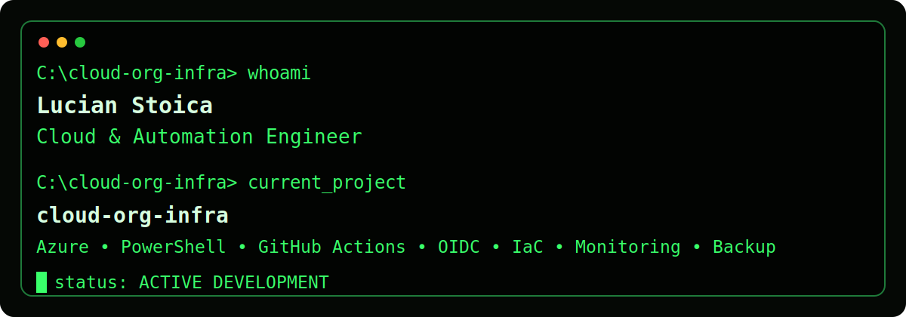

  

# 👋 Hi, I'm Lucian | Cloud & Automation Engineer  
> Passionate about building clean, scalable Azure infrastructures through automation and governance.

🚀 Building Azure automation blueprints with **PowerShell** & **GitHub Actions**  
📘 Focused on **Infrastructure-as-Code (IaC)**, **CI/CD**, and technical documentation excellence  

---

### 🧠 About Me
- 🌍 Based in Europe, working remotely on cloud projects  
- ☁️ Specializing in Azure automation, RBAC, and modular PowerShell scripting  
- 🛠️ Experience with enterprise environments, DevOps pipelines & troubleshooting

- ### 🏆 Highlights
- 🔧 Modular Azure automation blueprints with CI validation
- 🧩 PowerShell modules aligned to naming & tagging governance
- 🚀 Cross-platform GitHub Actions (Windows & Ubuntu)

### ⚙️ Tech Stack

  
  
  
  

### 📈 Current Focus
- Building practical Azure environments (VMs, storage, and networks)
- Automating deployments with PowerShell and GitHub Actions
- Advancing towards **AZ-104 certification**

### 🤝 Connect with Me
💬 Ping me via GitHub Discussions or check my pinned repositories.

---

🧩 *“Simple, scalable, and smart - that’s how I build in the cloud.”*
